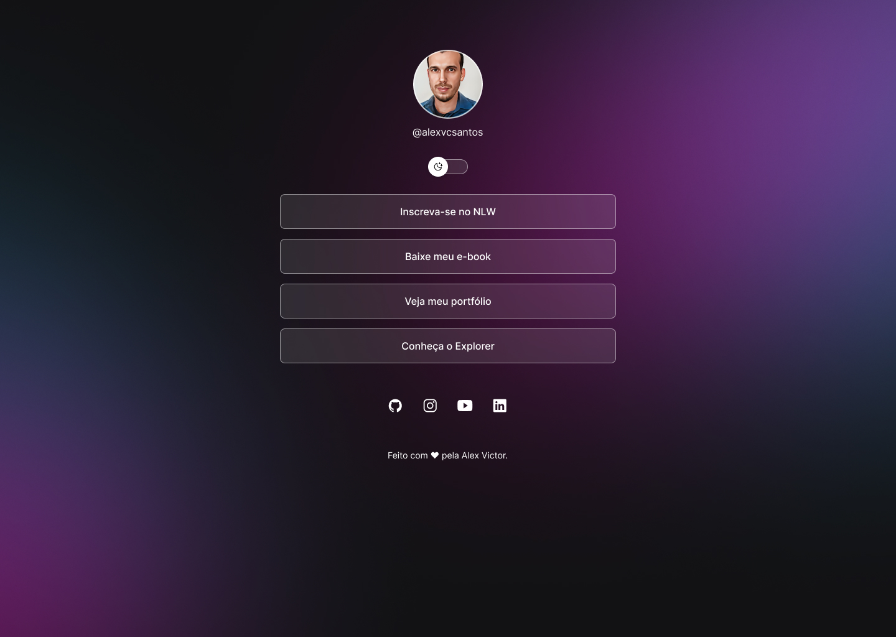

<h1 align="center"> Personal Page </h1>

Projeto Personal Page com links de contatos, usado como cartão de visitas on-line. Desenvolvido em curso da <a href="https://www.rocketseat.com.br/">Rocketseat</a> 

  <a href="#-tecnologias">Tecnologias</a>&nbsp;&nbsp;&nbsp;|&nbsp;&nbsp;&nbsp;
  <a href="#-projeto">Projeto</a>&nbsp;&nbsp;&nbsp;|&nbsp;&nbsp;&nbsp;
  <a href="#-layout">Layout</a>&nbsp;&nbsp;&nbsp;|&nbsp;&nbsp;&nbsp;
  <a href="#memo-licença">Licença</a>

  

 

  

## 🚀 Tecnologias

Esse projeto foi desenvolvido com as seguintes tecnologias:

- HTML e CSS
- JavaScript
- Git e Github
- Figma

## 💻 Projeto

Esse projeto é um agregador de links para usar como cartão de visitas online.

- [Acesse o projeto finalizado, online](https://alexvcsantos.github.io/projeto-personalpage/)

## 🔖 Layout

Layout desenvolvido com o Figma.

## :memo: Licença

Esse projeto está sob a licença MIT.

---

Feito com ♥ by Alex Victor :wave: